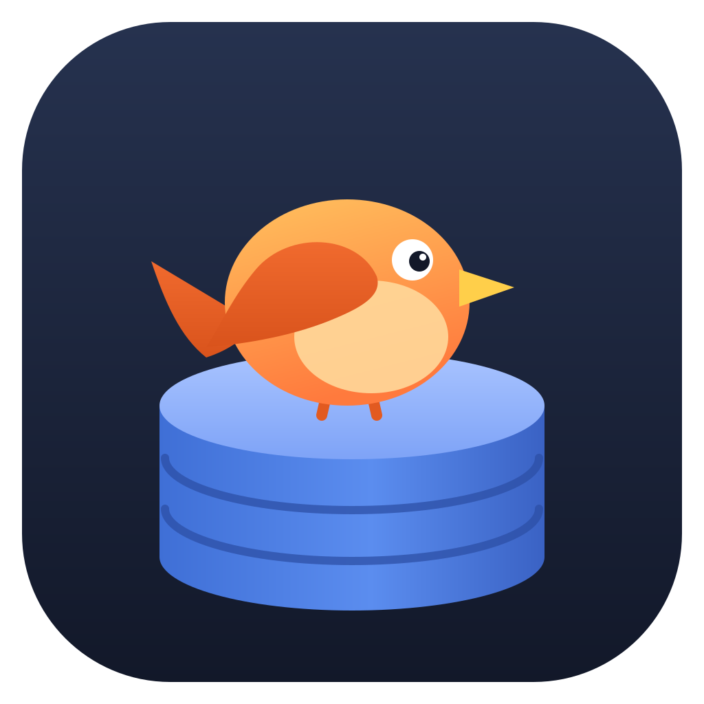

<p align="center"></p>

# dbird

[](https://github.com/jevido/dbird/actions/workflows/ci.yml)
[](https://github.com/jevido/dbird/releases/latest)

A lightweight SQL client, built as an alternative to DBeaver for the two things
used most: many saved connections, and tabbed SQL editors with a result grid.

Built with [Wails v3](https://v3.wails.io) (`v3.0.0-beta.18`), Go and Svelte 5.

## Features

- **Connections**: PostgreSQL, MySQL/MariaDB and SQLite. Host/port form or a raw
  connection URL/DSN, test button, color tag, duplicate/edit/delete.
- **Database tree**: schemas → tables/views → columns (with PK and types),
  lazy-loaded. Double-click a table to open its data. Filter box matches
  connection and table names. Right-click for more actions.
- **SQL editor tabs**: Monaco (the VS Code editor) with SQL highlighting per dialect and alias-aware
  autocompletion of tables/columns from the default schema. Per connection you
  choose how: load everything up front, look names up as you type (for huge
  schemas), keywords only, or automatic (the default: preload up to 5,000
  tables, look up beyond that). Tabs are restored
  on restart, can be renamed (double-click), reordered (drag) and closed with
  middle-click.
- **Execution**: each tab has its own dedicated database session, so `SET`,
  `USE`, `BEGIN`/`COMMIT` and temp tables behave like in a terminal client.
  Queries can be cancelled. A `DELETE` without a `WHERE` clause asks for
  confirmation before it runs.
- **Results**: virtualized grid (fast with 50k rows), sortable columns,
  resizable columns, keyboard navigation, value viewer with JSON formatting,
  copy as TSV, export to CSV. Scripts produce one result tab per statement.
- **Files**: open and save `.sql` scripts. Open scripts are watched: save the
  file in another editor (the toolbar button opens it in your default one) and
  dbird shows the new content. If the tab has unsaved edits (marked •), dbird
  asks before replacing them.

## Install

Download the latest build from [Releases](https://github.com/jevido/dbird/releases/latest).

| Platform | Download | Updates itself |
| --- | --- | --- |
| Linux | `dbird-linux-amd64.tar.gz` / `dbird-linux-arm64.tar.gz`: extract anywhere you can write, run `./dbird` | yes |
| Linux | `.AppImage`, `.deb`, `.rpm`, `.pkg.tar.zst` | no, you get a download link when a new version is out |
| macOS (Intel + Apple Silicon) | `dbird-darwin-universal.zip`: unzip and move `dbird.app` to Applications | yes |
| Windows | `dbird-windows-amd64.zip`: unzip and run `dbird.exe` (needs the WebView2 runtime, included in Windows 10/11) | yes |

Linux needs GTK 4 and WebKitGTK 6.0 (`libgtk-4-1 libwebkitgtk-6.0-4` on Debian/Ubuntu,
`gtk4 webkitgtk-6.0` on Arch/Fedora).

The macOS app is not notarized yet. After unzipping, run
`xattr -dr com.apple.quarantine /Applications/dbird.app` once, or right-click the app and choose Open.

### Updates

Release builds check GitHub Releases shortly after startup and then every 6 hours.
A newer version is downloaded in the background and verified against the release's
`checksums.txt`; the sidebar footer then shows **Restart to update**. Pre-releases are
never offered. Set `DBIRD_NO_UPDATE=1` to turn checking off.

## Keyboard shortcuts

| Keys | Action |
| --- | --- |
| `Ctrl+Enter` | Run statement under cursor (or the selection) |
| `Alt+X` / `Ctrl+Shift+Enter` | Run the whole script (or selection) statement by statement |
| `Ctrl+T` / `Ctrl+W` | New / close tab |
| `Ctrl+Tab`, `Ctrl+PageDown` / `Ctrl+Shift+Tab`, `Ctrl+PageUp` | Next / previous tab |
| `Ctrl+1`…`Ctrl+9` | Jump to tab (9 = last) |
| `Ctrl+O` / `Ctrl+S` / `Ctrl+Shift+S` | Open / save / save as `.sql` |
| `Ctrl+=` / `Ctrl+-` | Editor font size |
| `Ctrl+/` | Toggle comment |
| `F1` | Editor command palette (multi-cursor, go to line, …) |
| Grid: arrows, `Enter`, `Ctrl+C`, `Ctrl+Shift+C` | Move, view value, copy value, copy row |

Statements are split on `;` and on blank lines (like DBeaver's default), with
quotes, comments and PostgreSQL `$$` bodies respected. Routine bodies stay in
one piece: MySQL `CREATE PROCEDURE/FUNCTION/TRIGGER/EVENT … BEGIN … END` and
PostgreSQL `BEGIN ATOMIC … END`. MySQL scripts can also use `DELIMITER //`
lines like in the mysql client.

## Development

Requirements: Go 1.25+, Node 20+, the `wails3` CLI and the platform webview
libraries (`wails3 doctor` checks them).

```sh
wails3 task dev # hot-reloading dev mode (Vite on port 9270)
wails3 build    # production binary in bin/dbird
wails3 package  # AppImage/deb/rpm, .app, NSIS installer depending on OS
```

To try it against real databases, `wails3 task dev:db:up` starts sample
PostgreSQL and MySQL containers and creates a SQLite file, all filled with the
same small shop. Connection details and things to try are in
[dev/README.md](dev/README.md).

The release workflow cross-compiles Windows from Linux; you can do the same:
`wails3 build GOOS=windows`.

Tests:

```sh
go test ./internal/...                        # unit tests (SQLite)
(cd frontend && npm test)                     # statement splitter and DELETE guard
go test -tags integration ./internal/dbx/     # downloads and runs a real PostgreSQL
```

## Releasing

1. Push a tag: `git tag v0.1.0 && git push origin v0.1.0`.
2. The [Release workflow](.github/workflows/release.yml) builds Linux (amd64, arm64),
   macOS (universal) and Windows, writes `checksums.txt` and publishes a GitHub release
   with generated notes. Tags with a suffix (`v0.2.0-beta.1`) become pre-releases.
3. Running installs pick the update up automatically.

`scripts/set-version.sh` stamps the version into the platform metadata during the build;
the files in the repository keep `0.0.1` as a placeholder. Running the workflow manually
(Actions → Release → Run workflow) builds everything without publishing.

## Layout

- `main.go`, `services.go`, `files.go`, `updates.go`: Wails services, thin adapters exposed to the frontend.
- `internal/dbx`: drivers, DSNs, query execution, per-tab sessions, metadata queries.
- `internal/store`: JSON persistence of connections and open tabs.
- `frontend/src`: Svelte 5 UI (`lib/state.svelte.ts` holds app state).
- `assets/logo.svg`: the logo. `build/appicon.png` is rendered from it
  (`rsvg-convert -w 1024 -h 1024 assets/logo.svg -o build/appicon.png`), then
  `wails3 task common:generate:icons` makes the `.icns`/`.ico`.

Settings live in `~/.config/dbird/dbird.json` (or the OS equivalent). Saved
passwords are stored there in plain text; the file is created with mode 0600.

## License

[MIT](LICENSE)
